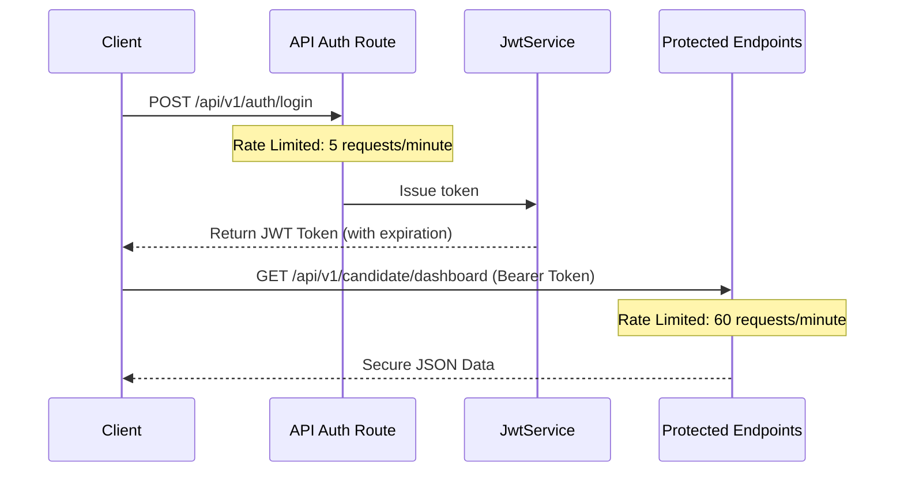

# REST API Endpoint Index 🔌

This index documents the Version 1.0 stateless REST API endpoints available in the system.

## Authentication Pipeline
We use stateless JSON Web Tokens (JWT) for authentication. Below is the lifecycle flow:

## Endpoint Groups Map
For full route mappings, see [[ROUTES]]. For request/response envelopes, see [[API]].

### 🔐 1. Authentication & Lifecycle
- `POST /api/v1/auth/register` — Candidate registration.
- `POST /api/v1/auth/login` — Token issuance.
- `POST /api/v1/auth/refresh` — Refresh expired token.
- `POST /api/v1/auth/logout` — Revoke current token.

### 🔍 2. Public Inquiries & Search
- `GET /api/v1/jobs` — Query paginated active job list.
- `GET /api/v1/jobs/{slug}` — Fetch details of a specific job post.
- `GET /api/v1/timeline` — Fetch lifecycle timeline of updates.
- `GET /api/v1/search/autocomplete` — Search text completions.

### 🧑‍💻 3. Candidate Actions
- `GET /api/v1/candidate/dashboard` — User statistics and matches.
- `PUT /api/v1/candidate/profile` — Modify user specifications.
- `POST /api/v1/candidate/bookmark` — Toggle job bookmarks.
- `POST /api/v1/candidate/apply` — Submit application forms.

### ⚙️ 4. Ingestion & Administration
- `POST /api/v1/extraction/upload` — Ingest raw PDF/Images.
- `GET /api/v1/extraction/status/{id}` — Query OCR and extraction status.
- `POST /api/v1/extraction/approve` — Quarantine bypass validation.

---
* 🏠 Home: [[Home]] | 📊 Dashboard: [[Dashboard]] | 🗺️ API MOC: [[API MOC]]
