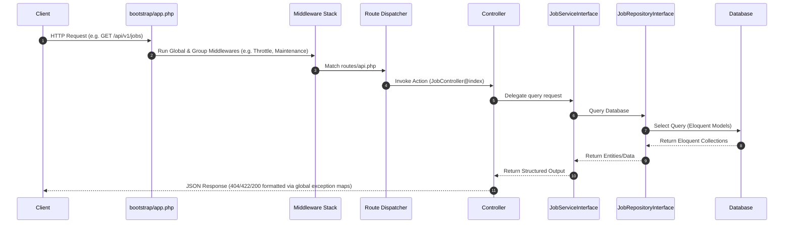

# Architecture: Code Layout & Control Flow

This document details the system design, core design patterns, request lifecycle, and component relationships of the `vision-mission` application.

---

## 1. Application Layers

The application uses an **n-tier Layered Architecture** with **Domain-Driven Design (DDD)** principles for separation of concerns:

```text
┌────────────────────────────────────────────────────────┐
│                  Presentation Layer                    │
│      (PWA Front-end Shell, Blade Views, CSS/Vite)      │
└───────────────────────────┬────────────────────────────┘
                            ▼
┌────────────────────────────────────────────────────────┐
│                     Routing Layer                      │
│        (web.php, api.php, admin.php, scraper.php)      │
└───────────────────────────┬────────────────────────────┘
                            ▼
┌────────────────────────────────────────────────────────┐
│                   Controllers Layer                    │
│   (Stateful AJAX & REST V1 - HTTP Exception Mapping)   │
└───────────────────────────┬────────────────────────────┘
                            ▼
┌────────────────────────────────────────────────────────┐
│                  Domain Service Layer                  │
│ (Scraping, OCR, Parsing, Lifecycle, Internal Linking)  │
└───────────────────────────┬────────────────────────────┘
                            ▼
┌────────────────────────────────────────────────────────┐
│              Repository / Abstraction Layer            │
│   (Decoupled DB Operations via Interface Bindings)     │
└───────────────────────────┬────────────────────────────┘
                            ▼
┌────────────────────────────────────────────────────────┐
│                   Persistence Layer                    │
│           (Eloquent Models & DB Migrations)            │
└────────────────────────────────────────────────────────┘
```

---

## 2. Request Lifecycle & Routing Execution Flow



---

## 3. Key Design Patterns

### A. Repository Pattern & Dependency Inversion Principle (DIP)
To maintain clean decoupling and facilitate testing, controllers and services never call Eloquent models or builders directly. Instead, they depend on interface abstractions.
* **Example**: `JobController` injects `JobServiceInterface` -> `JobService` injects `JobRepositoryInterface` -> bound to `JobRepository` (which queries the `JobPost` model).
* **Bindings**: Configured in [AppServiceProvider.php](file:///C:/xampp_8.2.12/htdocs/vision-mission/app/Providers/AppServiceProvider.php).

### B. Factory / Manager Pattern
Used to dynamically instantiate drivers depending on runtime configurations.
* **Scraper Drivers**: `ScraperDriverManager` instantiates specific scraper drivers (e.g., `SscScraperDriver`, `RailwayScraperDriver`, `DefaultHtmlScraperDriver`) implementing `ScraperDriverInterface`.
* **OCR Engines**: `OcrManager` determines the active engine (`GeminiOcrEngine`, `OpenAiOcrEngine`, `TesseractEngine`) depending on credentials or file qualities.

### C. State Machine Pattern (Lifecycle Transitions)
The `RecruitmentLifecycleManager` acts as a state transition machine. When a child corrigendum or result is ingested, it evaluates keywords or types and transitions the parent post's status through states like `published` $\to$ `admit_card_released` $\to$ `result_declared`.

### D. Observer Pattern
Managed via `JobPostObserver`. When a `JobPost` is saved, deleted, or restored, the observer automatically:
* Flushes sitemaps and homepage cache tags.
* Dispatches a background job to notify search engines via **IndexNow**.
