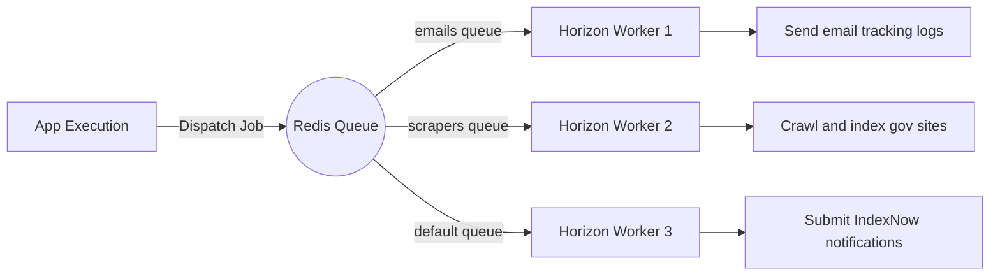

# Automation, Queues & Task Scheduling ⚡

Our system processes crawlers, emails, and indexing notifications asynchronously.

## Background Jobs Architecture
We use a Redis-backed queue manager running Laravel Horizon.

## Key Jobs Registry
See [[JOBS_AND_QUEUE]] for documentation of core jobs:
1. `GenerateJobContentJob` — Performs AI categorization and summarization.
2. `SendEmailJob` — Dispatches emails with embedded tracking tokens.
3. `SubmitToIndexNow` — Notifies search engine indexers of content changes.

## Task Scheduler Configuration
Active scheduled commands are configured in `routes/console.php` (see [[CRON_JOBS]]):
- `scraper:run` (Every 5 minutes, staggered)
- `scraper:detect-results` (Every 10 minutes)
- `email:send-alerts` (Daily at 09:00)
- `monetization:expire-features` (Daily at midnight)

---
* 🏠 Home: [[Home]] | 📊 Dashboard: [[Dashboard]] | 🗺️ Automation MOC: [[Automation MOC]]
