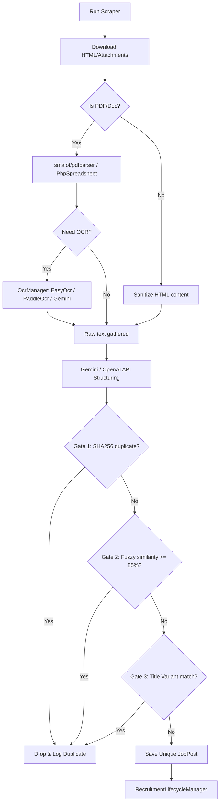

# Crawlers & Document Extraction Pipeline 🕷️

The core ingestion engine crawls government portals, downloads notifications, runs OCR, and extracts structured data.

## Scraper Execution Pipeline
Below is the full data processing workflow for crawler ingestion:

## Domain Scraper Modules
For technical layout, see [[MODULES#2 Scrapers Module]] and [[SERVICES#Scrapers Domain]].
- **ScraperController**: Gated admin endpoints to run, toggle, or inspect crawls.
- **ScrapingService**: Orchestration of crawling tasks.
- **FingerprintService**: Computes deduplication hash validations.

## Mitigations & Technical Debt
See [[KNOWN_ISSUES]] for details on handling:
- Crawler Timeout bottlenecks.
- Government website HTML structure modifications.
- LLM API timeout limits.

---
* 🏠 Home: [[Home]] | 📊 Dashboard: [[Dashboard]] | 🗺️ Crawler MOC: [[Crawler MOC]]
