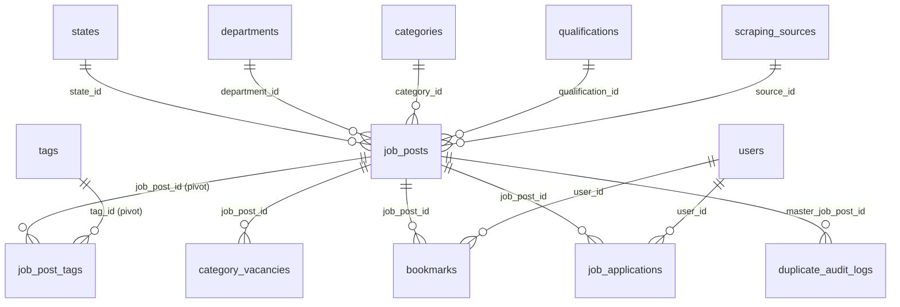

# Database Schema & Relationships Reference

This document maps out the database tables, keys, indexing, and logical purposes in the `vision-mission` application.

---

## 1. Schema Diagrams & Relationships

---

## 2. Core Tables Directory

### `job_posts`
* **Purpose**: Primary listings table for jobs, admit cards, answer keys, results, notices, and syllabi.
* **Primary Key**: `id` (bigint, auto-increment).
* **Foreign Keys**:
  * `department_id` references `departments(id)`.
  * `state_id` references `states(id)`.
  * `qualification_id` references `qualifications(id)`.
  * `category_id` references `categories(id)`.
  * `source_id` references `scraping_sources(id)` (nullable).
  * `parent_id` references `job_posts(id)` (nullable, self-referential parent).
* **Key Columns**: `title` (varchar), `slug` (varchar, unique), `post_type` (enum), `status` (enum), `last_date_to_apply` (date, indexed), `vacancy_count` (int), `fingerprint` (varchar, unique constraint).
* **Indexes**:
  * Composite: `uq_job_posts_fingerprint` (unique constraint on the SHA-256 code).
  * Composite: `status`, `published_at`, `is_featured`.
  * Index: `last_date_to_apply` (fast queries for expired/upcoming deadlined tasks).
  * Full-Text index (MySQL only) on `(title, description)` to speed up BOOLEAN matches.

### `users`
* **Purpose**: Holds candidates, admins, and editors.
* **Primary Key**: `id`.
* **Key Columns**: `email` (unique), `password`, `role` (varchar), `is_active` (boolean, default true).
* **Indexes**: `email` (unique), `is_active`.

### `scraping_sources`
* **Purpose**: Target links and selector properties for automated scraper runs.
* **Primary Key**: `id`.
* **Key Columns**: `name`, `source_url`, `selectors_config` (json), `crawl_interval_minutes` (int), `next_run_at` (datetime).

---

## 3. Metadata & Dynamic Tables

* **`categories`**, **`departments`**, **`states`**, **`qualifications`**, **`tags`**: Master entities. Joined via restrict constraints to maintain data integrity.
* **`job_post_tags`**: Pivot table joining `job_posts` and `tags` via composite primary key `(job_post_id, tag_id)`.
* **`category_vacancies`**: Tracks caste/gender vacancy breakdowns per job post.
* **`bookmarks`**: Maps candidate users with job posts. Composite index on `(user_id, job_post_id)`.
* **`job_applications`**: Maps user applications, storing resume paths.

---

## 4. Telemetry, Auditing & Settings

* **`analytics_page_views`**: Logs route traffic, HTTP headers, and user IPs.
* **`analytics_job_events`**: Tracks user clicks, shares, and application redirects.
* **`analytics_search_queries`**: Logs search inputs, autocorrection lists, and results count.
* **`scraping_logs`**: Execution logs tracking items scraped, failures, and quarantine reasons.
* **`duplicate_audit_logs`**: Logs duplicates captured during the 3-gate deduplication process.
* **`ai_audit_logs`**: Structuring confidence scores per ingestion.
* **`settings`** & **`setting_groups`**: Dynamic portal settings. Key-value structures with optional secret flag encryption support.
* **`cms_pages`**, **`menus`**, **`menu_items`**, **`social_links`**: CMS routing objects.
* **`personal_refresh_tokens`**: Stores refresh tokens mapped to user IDs for JWT operations.
