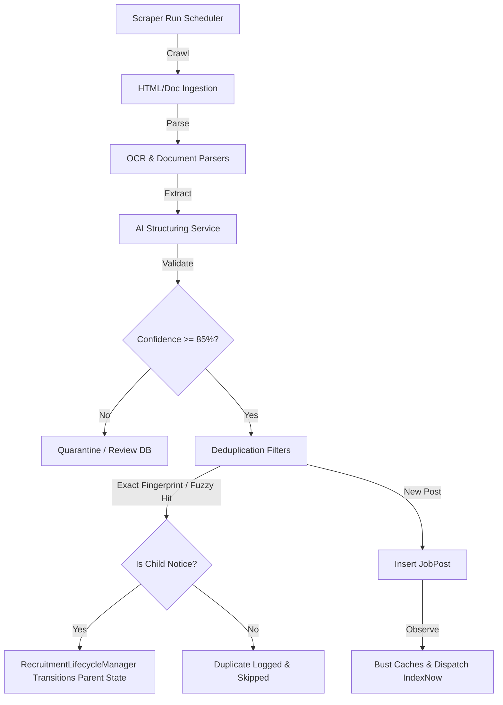

# Project Overview: vision-mission Job Portal

`vision-mission` is a high-performance, automated Indian Government Jobs Aggregator and Recruitment Lifecycle Tracker. It ingests public recruitment documents, parses and classifies them using AI, deduplicates them via dynamic fingerprinting, and publishes them for candidate searches, eligibility matching, and automated email alerts.

---

## Business Goals

1. **Automated Aggregation**: Eliminate manual data entry by crawling government websites and parsing unstructured notification documents (PDFs, DOCXs, CSVs).
2. **Lifecycle Tracking**: Track the complete progression of a recruitment notification—from application start to admit card releases, exam dates, answer keys, and final merit lists.
3. **SEO Traffic Capture**: Capture high-intent search traffic through programmatic landing pages targeted at specific qualifications, categories, departments, and geographic divisions (states and districts).
4. **Monetization**: Convert traffic through affiliate links, sponsored job postings, and premium memberships with advanced features.

---

## Tech Stack

* **Core Framework**: Laravel 12.x (PHP 8.2+)
* **Asynchronous Processing**: Laravel Horizon (Redis-backed queues)
* **Search Infrastructure**: Native MySQL Full-Text Search (with SQLite fallback for local development/tests)
* **Libraries & Packages**:
  * `spatie/laravel-permission`: Role and permission management.
  * `smalot/pdfparser`: PDF parsing.
  * `phpoffice/phpspreadsheet` & `phpoffice/phpword`: Excel and Word parsing.
* **Vite & Blade**: Dynamic frontend interface, featuring Progressive Web App (PWA) offline compatibility.

---

## Main Features

1. **Hybrid Ingestion & Scraping**: Crawling framework with adaptive run schedules based on posting frequency. Supports multiple domain scraper drivers.
2. **Multi-Engine Document Ingestion (OCR & Parsers)**: Standard document parsing paired with OCR fallback (PaddleOCR, Tesseract, GeminiOCR, EasyOCR) for scanned PDFs and image alerts.
3. **AI Structuring & Safety Checks**: Uses LLM integration (Gemini/OpenAI) to extract structured fields. Automatically computes a confidence score and quarantines extractions with <85% score.
4. **Recruitment State Machine**: The `RecruitmentLifecycleManager` links incoming corrigenda, results, and admit cards as "child" notices to their parent job posts, updating status, deadlines, and timelines automatically.
5. **SEO Engine & IndexNow**: Generates structured JSON-LD schemas and automatically triggers IndexNow notifications to search engines for newly published posts.
6. **Candidate Interactions**: Dashboard, bookmarks, resume submission, job alerts, and email tracking.

---

## Folder Structure

```text
C:\xampp_8.2.12\htdocs\vision-mission
├── app
│   ├── Console           # Scheduled commands and schedulers
│   ├── Domains           # DDD Module Layer
│   │   ├── Admin         # Admin views, queues, backups, settings
│   │   ├── Extraction    # OCR engines, CSV/PDF/Word parsers, AI Structuring
│   │   ├── Jobs          # Job postings, sitemaps, internal linking, SEO engine
│   │   ├── Notifications # Email/notification automation services
│   │   ├── Scrapers      # Scraper drivers, duplicate checks, fingerprinting
│   │   └── Users         # Authentication, dashboards, user profiles
│   ├── Helpers           # Global helpers
│   ├── Http              # Standard controllers and middlewares
│   ├── Jobs              # Global jobs (GenerateJobContentJob, SendEmailJob, etc.)
│   ├── Models            # Database models (38 models)
│   ├── Observers         # JobPostObserver (cache flush, IndexNow dispatch)
│   └── Providers         # AppServiceProvider (IoC bindings, guards, rate-limits)
├── bootstrap             # Configures routes, middlewares, exception renderers
├── config                # Framework configs (app.php, horizon.php, queue.php)
├── database              # Migrations, seeders, SQLite databases
├── routes                # web.php, api.php, admin.php, scraper.php, console.php
└── tests                 # 26 Feature Tests and regression suites
```

---

## High-Level Workflow


