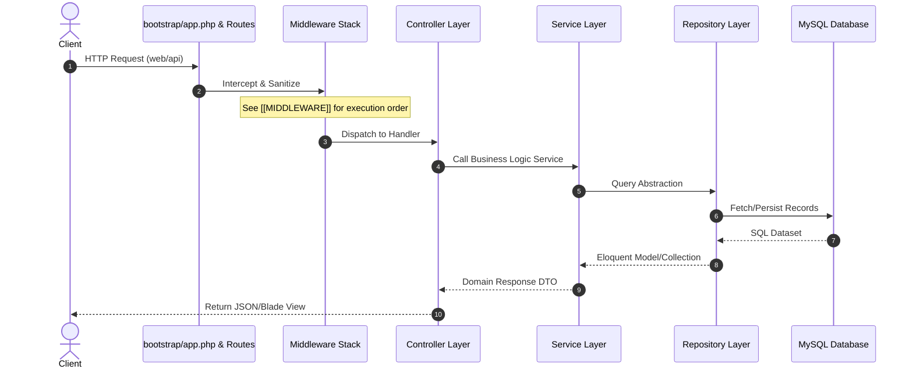

# System Architecture & Ingestion Flow 🏗️

This page documents the high-level architecture layouts and data pipelines.

## Layered Architecture & Request Lifecycle
For structural layer details, see [[ARCHITECTURE]]. Below is the sequence flow of HTTP requests:



## Data Ingestion & Crawler Workflow
Our primary core function is aggregating notification data from government sources. Below is the ingestion pipeline:

```mermaid
flowchart TD
    A[Cron / Scheduler] -->|Trigger| B[CrawlGovernmentSite Job]
    B --> C{Gov site accessible?}
    C -->|No| D[SSRF check / Error Logging]
    C -->|Yes| E[Download HTML & PDFs]
    E --> F[Document Parsers & OCR]
    Note over F: easyOCR, PaddleOCR, Tesseract, Gemini
    F --> G[Raw Extracted Text]
    G --> H[AI Structuring Service]
    H --> I{Confidence >= 85%?}
    I -->|No| J[Quarantine & Admin Rescue Alert]
    I -->|Yes| K[Deduplication Gate]
    Note over K: Fingerprint, fuzzy search, title variation
    K -->|Duplicate| L[Audit log duplicate details]
    K -->|Unique| M[Save JobPost & dispatch event]
    M --> N[JobPostObserver]
    N -->|IndexNow Webhook| O[Bing/Yandex API Notification]
    N -->|Cache Busting| P[Invalidate cache values]
    
    style J fill:#f9f,stroke:#333,stroke-width:2px
    style M fill:#bbf,stroke:#333,stroke-width:4px
```

For detailed queue configurations, see [[JOBS_AND_QUEUE]] and [[CRON_JOBS]].

---
* 🏠 Home: [[Home]] | 📊 Dashboard: [[Dashboard]] | 🗺️ Backend MOC: [[Backend MOC]]
